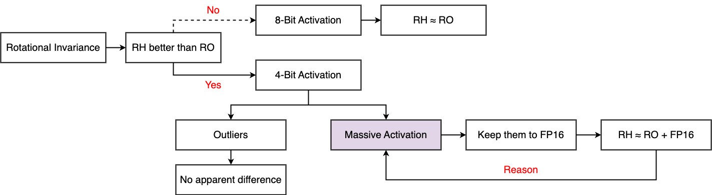

# DFRot: Achieving Outlier-Free and Massive Activation-Free for Rotated LLMs with Refined Rotation

## Motivation

In this paper, we have answered **why randomized orthogonal transforms better than randomized Hadamard transforms**.

## Preliminary

Understanding LLM's rotational invariance and Massive Activation will help you better understand our work:

1. [QuaRot: Outlier-Free 4-Bit Inference in Rotated LLMs](https://arxiv.org/abs/2404.00456)
2. [Massive Activations in Large Language Models](https://arxiv.org/abs/2402.17762)

## Visualization

**NR**: **N**o **R**otation; **RO**: **R**andomized **O**rthogonal transforms; 

**RH**:  **R**andomized **H**adamard transforms; **E**: Per Token Quantization Error.


| Method               | 4-4-4         | 4-4-16        | 4-8-16  | 4-4-4         | 4-4-16        | 4-8-16  | 4-4-4         | 4-4-16        | 4-8-16  | 4-4-4         | 4-4-16        | 4-8-16  |
|----------------------|---------------|---------------|---------|---------------|---------------|:--------|---------------|---------------|---------|---------------|---------------|---------|
|                      | **LLaMA2-7B** | **LLaMA2-7B** | **LLaMA2-7B** | **LLaMA2-13B** |**LLaMA2-13B**| **LLaMA2-13B** | **LLaMA3-8B** |**LLaMA3-8B**|**LLaMA3-8B**|**Mistral-7B-v0.3**|**Mistral-7B-v0.3**|**Mistral-7B-v0.3**|
| GPTQ                 | NaN           | NaN           | NaN     | Inf           | Inf           | 6.01    | Inf           | Inf           | 7.29    | Inf           | Inf           | 8.39    |
| (RO) QuaRot           | 7.96          | 7.71          | 5.61    | 6.00          | 5.92          | 4.99    | 10.54         | 10.15         | 6.52    | 6.05          | 5.98          | 5.40    |
| (RO) QuaRot.FP16()    | **6.17**      | **6.10**      | -       | **5.38**      | **5.34**      | -       | **7.83**      | **7.68**      | -       | **5.79**      | **5.73**      | -       |
| (RH) QuaRot           | 6.27          | 6.20          | 5.61    | 5.51          | 5.46          | 5.01    | 8.20          | 8.02          | 6.52    | 5.81          | 5.75          | 5.40    |
| (RH) QuaRot.FP16()   | **6.17**      | **6.10**      | -       | **5.40**      | **5.37**      | -       | **7.82**      | **7.67**      | -       | **5.78**      | **5.73**      | -       |

## Chain of Thoughts (CoT)



## Run for LLaMA3-8B

### 1. Generate Calibration Dataset

```shell
python3 generate_calibration.py --model meta-llama/Meta-Llama-3-8B --nsamples 1 \\
--output_dir calibration --disable_qk_rotation
```

### 2. Optimize Rotational Matrix

```shell
python3 optimize_procrustes_alter.py --rotate_mode hadamard --data_principle alter --alpha 100
```

### 3. Run Results

```shell
python3 main.py --model meta-llama/Meta-Llama-3-8B  --rotate --w_bits 4 --a_bits 4 --k_bits 4 \\
--v_bits 4 --w_clip --v_groupsize 128 --k_groupsize 128 --a_asym --k_asym --v_asym \\
--rotate_mode orthogonal_procrustes --indices_path rms_norm_feature_hadamard_alter/100/LLaMA-3-8B-4.npy \\
--fp32_had --seed 0 --lm_eval
```

## More Scripts

```shell
# Random, Hadamard, Procrustes Scripts
CUDA_VISIBLE_DEVICES=None python3 scripts/generate_scripts.py
# For QuaRot.FP16()
CUDA_VISIBLE_DEVICES=None python3 scripts/separate_scripts.py
# Calibration Dataset
CUDA_VISIBLE_DEVICES=None python3 scripts/generate_calibration.py
# Without Rotation
CUDA_VISIBLE_DEVICES=None python3 scripts/vanilla_scripts.py
```

## Main Results on WikiText-2 PPL

| Method        | **LLaMA2-7B** | **LLaMA2-7B** | **LLaMA2-13B** | **LLaMA2-13B** | **LLaMA3-8B** | **LLaMA3-8B** | **Mistral-7B-v0.3** | **Mistral-7B-v0.3** |
|---------------|---------------|---------------|----------------|----------------|---------------|---------------|---------------------|---------------------|
| Baseline      | 5.47          | 5.47          | 4.88           | 4.88           | 6.14          | 6.14          | 5.32                | 5.32                |
| Extra Time    | +8min         | +8min         | +20min         | +20min         | +8min         | +8min         | +8min               | +8min               |
|               | **4-4-4**     | **4-4-16**    | **4-4-4**      | **4-4-16**     | **4-4-4**     | **4-4-16**    | **4-4-4**           | **4-4-16**          |
| RTN           | NaN           | NaN           | Inf            | Inf            | Inf           | Inf           | Inf                 | Inf                 |
| QuaRot-RTN    | 9.04          | 8.69          | 6.31           | 6.23           | 11.06         | 10.47         | 6.38                | 6.29                |
| DFRot-RTN     | 7.68          | 7.47          | 6.21           | 6.12           | 9.67          | 9.35          | 6.36                | 6.27                |
| GPTQ          | NaN           | NaN           | Inf            | Inf            | Inf           | Inf           | Inf                 | Inf                 |
| QuaRot-GPTQ   | 6.27          | 6.20          | 5.51           | 5.47           | 8.20          | 8.02          | 5.81                | 5.75                |
| DFRot-GPTQ    | 6.21          | 6.14          | 5.47           | 5.39           | 7.95          | 7.81          | 5.81                | 5.76                |

## Main Results on Zero-Shot tasks

| **Model**           | **Method** | **W-A-KV** | **PQ** | **WG** | **HS** | **A-e** | **A-c** | **LA** | **Avg.** |
| ------------------- | ---------- | ---------- | ------ | ------ | ------ | ------- | ------- | ------ | -------- |
| **LLaMA2-7B**       | FP16       | 16-16-16   | 79.11  | 68.98  | 75.99  | 74.54   | 46.42   | 73.88  | 69.82    |
|                     | **QuaRot** | 4-4-16     | 76.06  | 65.67  | 73.00  | 69.82   | 42.24   | 69.42  | 66.03    |
|                     |            | 4-4-4      | 76.33  | 64.96  | 72.69  | 68.60   | 41.64   | 68.58  | 65.47    |
|                     | **DFRot**  | 4-4-16     | 77.15  | 65.82  | 73.17  | 69.78   | 44.37   | 70.66  | 66.83    |
|                     |            | 4-4-4      | 76.22  | 64.96  | 72.41  | 70.75   | 42.66   | 69.92  | 66.15    |
| **LLaMA2-13B**      | FP16       | 16-16-16   | 80.52  | 72.22  | 79.39  | 77.48   | 49.15   | 76.75  | 72.58    |
|                     | **QuaRot** | 4-4-16     | 77.91  | 68.51  | 75.94  | 73.57   | 46.25   | 72.97  | 69.19    |
|                     |            | 4-4-4      | 78.73  | 70.40  | 75.82  | 73.74   | 46.33   | 72.73  | 69.63    |
|                     | **DFRot**  | 4-4-16     | 78.73  | 69.30  | 76.99  | 72.69   | 45.82   | 75.41  | 69.82    |
|                     |            | 4-4-4      | 79.82  | 68.43  | 76.70  | 72.64   | 46.59   | 75.33  | 69.92    |
| **LLaMA3-8B**       | FP16       | 16-16-16   | 80.79  | 72.85  | 79.16  | 77.78   | 53.33   | 76.03  | 73.32    |
|                     | **QuaRot** | 4-4-16     | 74.92  | 66.61  | 73.39  | 70.29   | 44.54   | 67.71  | 66.24    |
|                     |            | 4-4-4      | 75.14  | 66.54  | 72.32  | 68.64   | 42.41   | 66.04  | 65.18    |
|                     | **DFRot**  | 4-4-16     | 76.22  | 68.03  | 73.92  | 70.41   | 45.65   | 68.87  | 67.18    |
|                     |            | 4-4-4      | 75.68  | 66.77  | 73.56  | 70.29   | 45.14   | 68.99  | 66.74    |
| **Mistral-7B-v0.3** | FP16       | 16-16-16   | 82.26  | 73.88  | 80.41  | 78.20   | 52.30   | 75.32  | 73.73    |
|                     | **QuaRot** | 4-4-16     | 79.54  | 69.30  | 77.81  | 75.51   | 47.95   | 73.76  | 70.65    |
|                     |            | 4-4-4      | 79.38  | 69.06  | 77.36  | 74.54   | 48.29   | 73.55  | 70.36    |
|                     | **DFRot**  | 4-4-16     | 79.87  | 69.53  | 78.24  | 75.88   | 48.46   | 73.01  | 70.83    |
|                     |            | 4-4-4      | 80.36  | 69.61  | 78.01  | 75.55   | 47.95   | 72.39  | 70.65    |

# Reference

If you find DFRot useful or relevant to your research, please cite our paper:

```bibtex
@article{xiang2024dfrot,
  title={DFRot: Achieving Outlier-Free and Massive Activation-Free for Rotated LLMs with Refined Rotation},
  author={Xiang, Jingyang and Zhang, Saiqian},
  journal={arXiv preprint arXiv:2412.00648},
  year={2024}
}
```
